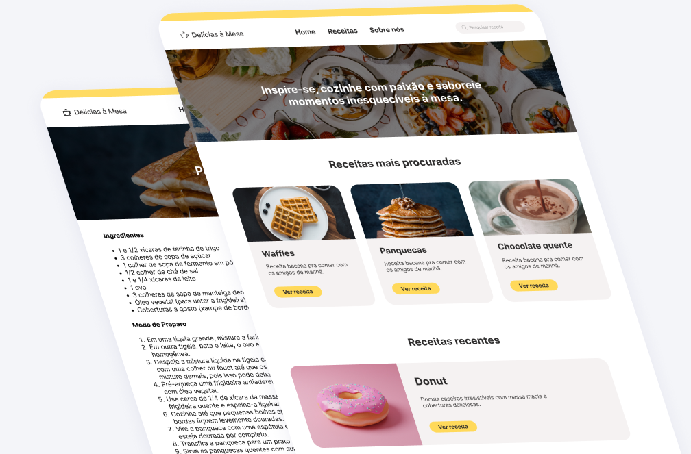

<h1 align="center">Recipe App </h1>

**(React, Typescript, RapidAPI, Redux Toolkit)** 

## Project Overview

The Recipe App is a platform that allows users to discover and share recipes. It leverages the Spoonacular API to provide a rich database of recipes for users to explore. 

This project is part of the **TechloSet Bootcamps** under the Coding Bootcamp 7.0 list.

**Live Demo at:** https://arslan-recipe-app.netlify.app/

## Tech Stack

This is the template of 'Recipe App', all data used is fetched from **RapidAPI**, and ***react** via vite* is used along with **Typescript** and states are managed by **redux toolkit**.

## Features

- **Home Page**: Displays featured recipes and includes a search bar for finding recipes.
- **Recipe Listings**: Paginated list of recipes for easy browsing.
- **Recipe Details**: Detailed view of each recipe, including related recipes.

## Project Structure

- **TypeScript**: Ensure type safety by avoiding `any` or `unknown` types.
- **Naming Conventions**: Follow consistent naming conventions for variables, functions, and components.
- **File Organization**: Organize files into designated folders for components, styles, and utilities.

## License

This project is licensed under the **MIT License**.

[comment]: <> (Ending section)

  
  
    <em><b>I genuinely enjoy connecting with new people</b>, so if you'd like to say <b>hi, I'd be delighted to get to know you better!</b> </em>
    <a href="https://linkedin.com/in/arslan-ahmad-dev">Let's talk</a>🙃
  

